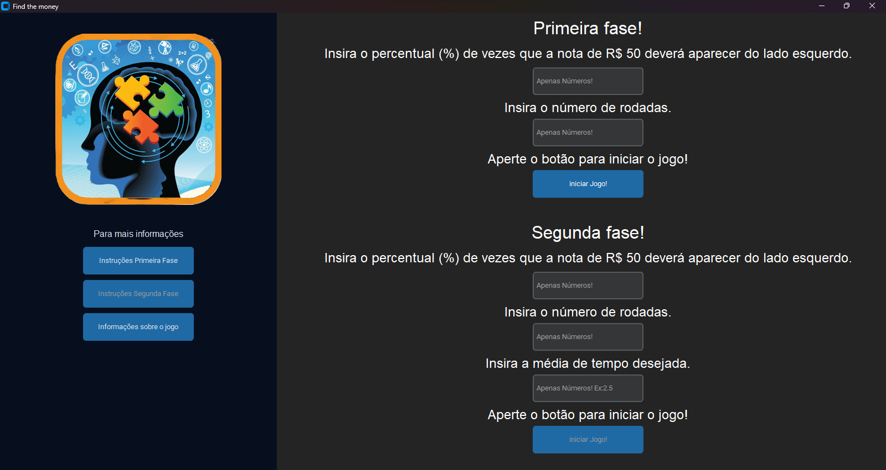

# Jogo Find the money

> Este é um jogo simples onde o jogador deve encontrar a nota de R$ 50 ou R$ 100 em diferentes rodadas. O jogo é dividido em duas fases, cada uma com suas próprias regras.

### Ajustes e melhorias

O projeto ainda está em desenvolvimento e as próximas atualizações serão voltadas nas seguintes tarefas:

- [ ] Adicionar mais opções de personalização para o jogador.
- [ ] Implementar um sistema de pontuação mais detalhado.

## 💻 Pré-requisitos

Antes de começar, verifique se você atendeu aos seguintes requisitos:

- Você tem uma máquina com suporte para executar aplicativos Python.
- Certifique-se de ter as imagens das notas na pasta "assets" no mesmo diretório do script.

## 🚀 Instalando Jogo Find the money

Para instalar o Jogo Find the money, siga estas etapas:

1. Abra a pasta 'dist'.
2. Depois a pasta 'app'.
3. Em seguida Execute o script `app.py`.

## ☕ Usando Jogo Find the money

Para jogar o Jogo Find the money, siga estas etapas:

- Após executar o script `app.py`, siga as instruções na interface gráfica para jogar.

## 📫 Contribuindo para Jogo Find the money

Para contribuir com Jogo Find the money, siga estas etapas:

1. Bifurque este repositório.
2. Crie um branch: `git checkout -b <nome_branch>`.
3. Faça suas alterações e confirme-as: `git commit -m '<mensagem_commit>'`
4. Envie para o branch original: `git push origin <nome_do_projeto> / <local>`
5. Crie a solicitação de pull.

Como alternativa, consulte a documentação do GitHub em [como criar uma solicitação pull](https://help.github.com/en/github/collaborating-with-issues-and-pull-requests/creating-a-pull-request).

## 🤝 Colaboradores

Agradecemos às seguintes pessoas que contribuíram para este projeto:

<table>
  <tr>
    <td align="center">
      <a href="#" title="defina o titulo do link">
         
        
          <b>André Coêlho</b>
           
          <b>Contribuidor</b>
        
      </a>
    </td>
    <td align="center">
      <a href="#" title="defina o titulo do link">
         
        
          <b>Daniel Almeida</b>
           
          <b>Orientador</b>
        
      </a>
    </td>
  </tr>
</table>

## 😄 Seja um dos contribuidores

Quer fazer parte desse projeto? Clique [AQUI](CONTRIBUTING.md) e leia como contribuir.

## 📝 Licença

Esse projeto está sob licença. Veja o arquivo [LICENÇA](LICENSE.md) para mais detalhes.
